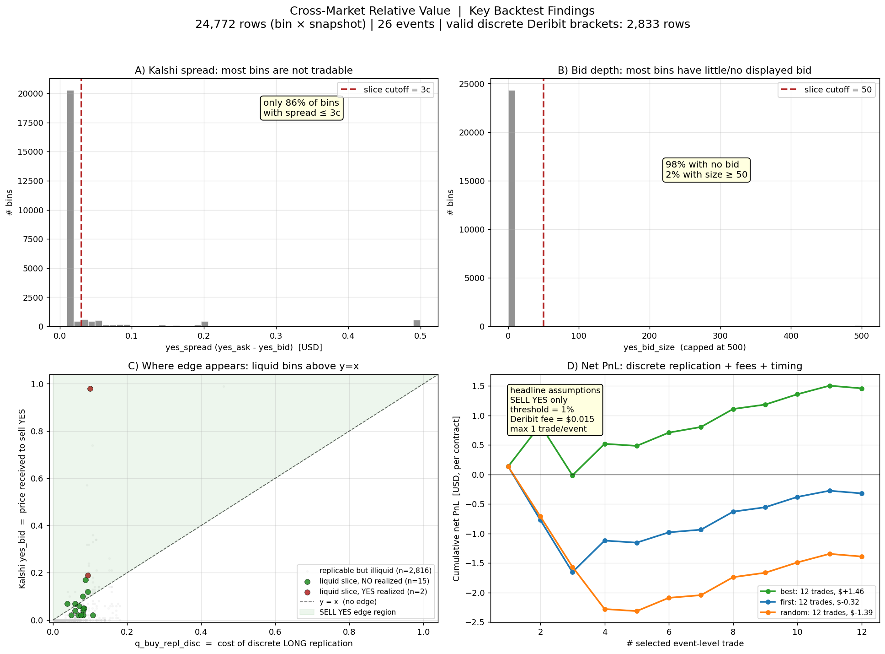

# Cross-Market Relative Value Research

### BTC Options (Deribit) ↔ Prediction Markets (Kalshi)

> Risk-neutral density extraction from the Deribit option smile, executable
> replication via discrete vertical spreads, and per-bin comparison against
> Kalshi hourly binary contracts (KXBTC).

---

## TL;DR

I built an end-to-end research pipeline that prices Kalshi BTC binary contracts
against an SVI-calibrated risk-neutral distribution from Deribit options.
Across the canonical backtest (71 settled hourly events, 7,775 snapshots and
1.38M bin-snapshot observations from the event-driven collector), the model's
`q_deribit` is **20% better in Brier score** (0.00481 vs 0.00602) and **34%
better in log loss** (0.0184 vs 0.0281) than Kalshi mid-prices. **However**,
once executable replication via discrete Deribit strikes is enforced and
Kalshi + Deribit fees and per-event de-correlation are applied, the edge
disappears: net PnL is negative at every threshold except a marginal +$0.06
at a 5% threshold (24 buy / 63 sell trades), and only 14% of observations
have an executable Deribit bracket at all.

The project demonstrates **the gap between theoretical fair value and
executable edge in cross-market relative value** — a trap most cross-market
arbitrage projects fall into and rarely surface.

---

## Motivation

Two markets price BTC outcomes with different microstructures:

- **Kalshi** offers hourly binary contracts (`KXBTC-YYMMMDDHH-...`) paying $1
  if BTC settles in a $100 range at the top of each hour. ~200 bins per event.
- **Deribit** trades vanilla BTC options (calls/puts at discrete strikes,
  daily/weekly/monthly expiries). The option smile implies a continuous
  risk-neutral distribution.

If both markets are mispriced relative to each other (after accounting for
costs, basis between settlement indices, and execution constraints), there's
exploitable cross-market signal. This project quantifies whether that signal
exists for a small/retail trader operating with REST API snapshots.

---

## The journey — problems and how I solved them

This project is best understood as a sequence of problems, each of which broke
the previous design and forced a more honest one. The interesting content is
the failures, not the final pipeline.

### Problem 0 — The markets don't line up

The original idea was naive: extract a risk-neutral probability from Deribit
at some expiry `T`, read the Kalshi contract at the same `T`, compare, trade
the difference. **It doesn't work**, because the two instruments never share
an expiry: Kalshi `KXBTC` only lists *hourly intraday* binaries (settled on a
60-second BRTI average at the top of each hour), while Deribit options only
expire at **08:00 UTC** (daily/weekly/monthly). There is no Deribit expiry at
3pm on a Tuesday.

**Solution:** redesign around an *intraday horizon*. Price the Kalshi bin that
settles at `T_K` (minutes away) using the nearest Deribit expiry `T_D > T_K`
(hours away), and bridge the gap with a term-structure assumption.

### Problem 1 — There is no volatility at `T_K`, only at `T_D`

The Deribit smile gives implied vol at `T_D`, not at the much shorter `T_K`.

**Solution:** VLT scaling (variance linear in time): assume `σ_imp(K)` is
horizon-independent, so the implied vol read off the `T_D` smile is reused to
compute `P^Q(L ≤ S_{T_K} ≤ U) = N(d2(L)) − N(d2(U))` under Black–Scholes at
`T_K`. This is the central — and most contestable — modelling assumption, and
the backtest later quantifies exactly how well it holds by horizon.

### Problem 2 — Option quotes are discrete, noisy, and incomplete

Raw Deribit strikes are sparse and bid/ask-noisy; a per-strike probability is
unstable.

**Solution:** fit an **SVI raw 5-parameter** smile (`src/model/svi.py`),
OTM-only (puts for `K<F`, calls for `K≥F`), weighted by `1/spread`, with the
put–call-parity forward `F = K + e^{rT}(C−P)` from ATM pairs. This yields a
continuous, arbitrage-aware density instead of noisy point estimates. Sanity
check enforced in the backtest: `Σ q_deribit ≈ 0.9999` over the strip.

### Problem 3 — A mid-price probability is not tradable

`q_deribit` uses option *mid* prices. You cannot trade a mid: you pay the ask
and receive the bid.

**Solution:** fit **three SVI curves** (`src/model/exec_price.py`) — `svi_mid`
(theoretical), `svi_bid` (worst case shorting the Deribit hedge), `svi_ask`
(worst case going long) — producing `q_buy_exec`/`q_sell_exec`, the actual
cost to go long/short the replication.

### Problem 4 — Even a bid/ask probability isn't what you trade

You don't trade a density; you trade *discrete Deribit verticals*. Deribit
strikes are $500–$1000 apart; Kalshi bins are $100 wide. A Kalshi binary
cannot be replicated — the closest construct is a call vertical paying a
triangular ramp over a 5× wider range, with structural tracking error.

**Solution:** `src/model/replication_discrete.py` finds the real strikes
`K_low ≤ L < U ≤ K_high` bracketing each bin, builds the executable vertical,
and prices it net of cost. **Discovery:** only **14% of bin-snapshots** have a
valid executable bracket at all (panel A/B of the figure) — the other 86% are
unhedgeable in practice. This single number reframed the whole project.

### Problem 5 — The first backtest "made money" (it didn't)

An early backtest with a "best opportunity per event" aggregation showed
positive PnL. It was an artifact: picking, with hindsight, the best of several
correlated snapshots inside the same event.

**Solution:** the backtest (`src/runner/backtest.py`) now de-correlates
snapshots per event with three modes — *best* (optimistic, kept only to show
the bias), *first* (realistic timing), *random* (control) — and charges the
**official Kalshi fee** `ceil(0.07·p·(1−p))` plus a Deribit constant. Under
realistic timing the edge disappears (panel D). This is the project's core
result and the reason it exists.

### Problem 6 — 60-second REST snapshots are too stale to trust

A fixed 60s poll mixes fresh and stale quotes and cannot measure how fast any
signal decays.

**Solution:** an **event-driven collector** (`src/event_snapshotter.py`) that
polls fast but only persists a snapshot when bid/ask/size *state changes* on
either venue, writing the same schema so the backtest runs unchanged on it.
Its `changed_side` metadata is fed into the backtest to test the "edge appears
when Kalshi moves but Deribit hasn't" hypothesis (it doesn't, materially). The
canonical run uses this dataset.

### Problem 7 — Bad SVI fits silently poison the metrics

Some expiries are illiquid or stale; a bad fit produces confident-looking but
garbage probabilities.

**Solution:** an expiry **quality score** (`src/model/quality.py`) and a
bootstrap confidence interval on the SVI fit, available as a backtest filter
and a per-bin diagnostic.

### Problem 8 — The documentation claimed numbers nothing could reproduce

The earlier README headline (26 events, a different Brier, a "+$1.46" PnL)
matched **no committed artifact**. For a research repo this is the worst kind
of bug.

**Solution:** one **canonical run** over the full event-driven dataset
(71 settled events, 7,775 snapshots, 1,379,512 observations), its report
committed (`data/reports/backtest_canonical.txt`), a 1-day reproducible
subset bundled in-repo, and every number in this README/CHECKPOINT traced to
it. In the process I found and now disclose that the 20% Brier "win" is
amplified by the 0.56% YES base rate, not by large-probability skill.

### Problem 9 — If taking the spread loses, can we *make* it instead?

The taker strategy crosses Kalshi's wide spread and loses. The natural
follow-up: post a tighter two-sided market around `q_deribit` and capture the
spread as a maker. The objection is **adverse selection** — a resting quote
fills precisely when the market (and BTC) has moved against the stale REST
price it was based on.

**Solution:** `src/runner/passive_fill.py` models this explicitly. A quote
posted at snapshot `t` fills only if the market trades *through* it by `t+1`,
and the Deribit hedge is repriced at `t+1` (so the move that triggers the
fill also moves the hedge). Restricted to the hedgeable, liquid,
near-settle slice and de-correlated per event:

| Variant | n fills | hedged PnL net |
|---|---|---|
| naive (every posted quote fills @ t, hedged @ t — optimistic control) | 91 | **−$4.09** |
| adverse (fills @ t+1 only, hedged @ t+1 — honest) | 56 | **−$2.42** |

The maker idea **does not survive** either. The instructive detail: the
*un-hedged* naive PnL is *positive* (+$1.98) because binaries mostly settle
NO at a 0.56% base rate — the classic short-gamma "pick up pennies" illusion.
Once the position is actually hedged, and once fills are conditioned on the
adverse move that produced them, it is net-negative at every half-spread
except a degenerate ~5¢ quote that barely improves the book.

### Where it stands now

The pipeline is honest end-to-end and the result is **negative**: there is no
robust executable edge for a retail REST-API trader — neither as a taker
(Problem 5) nor as a maker (Problem 9). That negative result, properly
demonstrated, is the deliverable.



Other views of the same run: `notebooks/01_project_guide.ipynb` (reader
guide), the Streamlit app (`bash analytics.sh`, interactive threshold/spread/
fee sliders), and the Tkinter dashboard (`bash dash.sh`, live snapshot view).

---

## Key findings

All numbers below come from the canonical run (`data/reports/backtest_canonical.txt`):
event-driven dataset, stride 1, 71 settled events, 7,775 snapshots, 1,379,512
bin-snapshot observations, base rate `p_yes = 0.0056`.

### 1. The model beats Kalshi mids on probabilistic scoring

| Metric | `q_deribit` (model) | `yes_mid` (Kalshi) |
|---|---|---|
| Brier score | **0.004812** | 0.006023 |
| Log loss | **0.018406** | 0.028052 |

That is a 20% Brier and 34% log-loss improvement. Caveat: with a 0.56% YES
base rate, ~98% of observations sit in the 0–10% bucket, so both models score
well by predicting near-zero; the comparison is real but the magnitude is
inflated by the base rate, not by large-probability skill.

### 2. Kalshi mids systematically over-predict realized probabilities

In the 0.4–0.5 prediction bucket, Kalshi mids predict 0.461 but realized
frequency is 0.073 (bias **−0.39**). This is microstructural, not a market
failure: spreads are wide and mids are not executable.

### 3. The executable edge against discrete replication is fragile

PnL against `q_*_repl_disc` (the closest Deribit vertical bracketing the bin),
SELL+BUY YES, one trade per event, Kalshi fee `ceil(0.07*p*(1-p))`, Deribit
fee `$0.015`/contract, net of fees:

| Threshold | n buy | n sell | PnL net |
|---|---|---|---|
| 0.5% | 57 | 69 | **−$1.99** |
| 1.0% | 54 | 68 | **−$1.86** |
| 2.0% | 45 | 67 | **−$1.44** |
| 3.0% | 38 | 67 | **−$1.05** |
| 5.0% | 24 | 63 | **+$0.06** |

Net PnL is negative at every threshold except a marginal break-even at 5%.
Liquidity-filtered slices (spread ≤ 1–2¢, size ≥ 50) show small positive PnL
(+$2.3 to +$2.6 over ~40–60 trades) but these are small-sample slices of a
1.38M-row dataset and should be read as "not yet ruled out", not as edge.

### 4. Only 14.0% of bin-snapshot observations (193,228 / 1,379,512) have an
executable Deribit bracket with valid bid/ask quotes. The rest are
unhedgeable in practice.

### 5. The structural mismatch

Deribit trades strikes every $500–$1000. Kalshi bins are $100 wide. **Perfect
replication of a Kalshi binary in Deribit is impossible** — the closest
construct is a vertical spread paying a triangular ramp over a 5× wider range.
This introduces tracking error that vanilla payoff comparison ignores.

---

## Project structure

```
.
├── src/
│   ├── snapshotter.py              # 60s polling loop → JSON.gz snapshots
│   ├── event_snapshotter.py        # event-driven collector (writes on quote change)
│   ├── io/load.py                  # in-memory loaders, no I/O over network
│   ├── model/
│   │   ├── black_scholes.py        # bs_call, bs_put, bs_digital, implied_vol
│   │   ├── svi.py                  # SVI raw param + fit + analytical derivs
│   │   ├── intraday_q.py           # VLT-scaled range probability
│   │   ├── exec_price.py           # 3-sided SVI fit (bid/mid/ask)
│   │   ├── replication_discrete.py # discrete vertical-spread pricing
│   │   ├── quality.py              # Deribit expiry quality score
│   │   └── fees.py                 # Kalshi + Deribit fee model
│   ├── signal/edge.py              # per-bin edge annotations
│   ├── runner/
│   │   ├── analyze.py              # pure pipeline + CLI
│   │   ├── backtest.py             # offline PnL evaluation (taker)
│   │   ├── passive_fill.py         # maker / adverse-selection backtest
│   │   └── visualize_findings.py   # static 4-panel plot
│   └── ui/
│       ├── dashboard.py            # Tkinter live view
│       └── streamlit_app.py        # interactive analytics
├── data/
│   ├── sample_snapshots/           # committed 1-day subset (reproducible backtest)
│   └── reports/                    # committed canonical run output + findings.png
├── notebooks/01_project_guide.ipynb # reader-facing guide to the project
├── tests/                          # lightweight model sanity tests
├── CHECKPOINT.md                   # plain-language project explanation
├── LICENSE                         # MIT license
├── start.sh / stop.sh              # snapshotter lifecycle
├── event_start.sh / event_stop.sh  # event-driven snapshotter lifecycle
├── backtest.sh                     # re-run backtest
├── analytics.sh                    # launch Streamlit
└── dash.sh                         # launch Tkinter dashboard
```

---

## Quick start

```bash
# Setup (Python 3.9+)
python3 -m venv .venv
source .venv/bin/activate
pip install -r requirements.txt

# Collect data (runs in background, polls every 60s)
bash start.sh

# Alternative: event-driven collection (polls often, writes only changes)
bash event_start.sh

# Reproduce the committed reference run on the bundled sample subset
bash backtest.sh --snapshots data/sample_snapshots --stride 1 \
                 --out data/reports/backtest_sample.csv

# After accumulating your own snapshots, run the full backtest
bash backtest.sh --snapshots data/event_snapshots --stride 1
bash backtest.sh --all-trades        # disable per-event aggregation
bash backtest.sh --fees-deribit 0.02 # custom Deribit fee

# Maker / adverse-selection backtest (Problem 9)
.venv/bin/python -m src.runner.passive_fill                 # canonical run
.venv/bin/python -m src.runner.passive_fill --max-tk-min -1 # no near-settle filter

# Run tests
python3 -m unittest discover -s tests

# Launch interactive analytics (browser opens at localhost:8501)
bash analytics.sh
```

Full raw snapshot history (~1.6 GB) is gitignored. A 1-day subset is committed
under `data/sample_snapshots/` so a third party can reproduce a backtest on
`git clone` without external data. The headline numbers below come from the
**canonical run over the full event-driven dataset** (`data/reports/backtest_canonical.txt`,
committed); the sample subset reproduces the same pipeline on less data.

---

## Tech stack

**Core:** Python 3.9, NumPy, SciPy (`brentq`, `least_squares`), Pandas
**Visualization:** Matplotlib, Plotly, Streamlit, Tkinter
**Testing:** Python `unittest`
**APIs:** Kalshi REST (`/trade-api/v2/markets`, `/events`),
Deribit REST (`/public/get_instruments`, `/get_book_summary_by_currency`,
`/get_index_price`)
**Data:** gzipped JSON snapshots (lossless, schema-flexible, no Parquet
dependency)

---

## Limitations and future work

The project is a research artifact, not a production trading system. Known
gaps before any live use:

**Modeling**
- VLT scaling is assumed; SSVI with no-calendar-arbitrage constraints would be
  more rigorous for multi-expiry.
- Bootstrap CI of SVI fits is implemented as an optional diagnostic, but not
  yet used as a default trade filter.
- Expiry quality scoring is implemented, but production use would require
  stricter threshold calibration.
- Hybrid IV + realized-vol level adjustment for short horizons.

**Microstructure (the real issue)**
- 60s REST snapshots are too slow for live execution. WebSocket order book
  feeds are required.
- Adverse selection: signals that survive long enough for a 60s pipeline to
  detect are likely already taken or are toxic flow.
- Deribit option spreads outside ATM are wide; the executable replication
  set is small (14% of bin-snapshots in the canonical run).

**Economics**
- BRTI vs Deribit Index basis is not modeled.
- Path dependence between T_K (Kalshi settle) and T_D (Deribit expiry) is
  not Δ-hedged in the backtest.
- Tracking error from rectangular-vs-triangular payoff is acknowledged but
  not quantified per-trade.

**Sample size**
- 71 settled events over ~5 days. Larger than the early runs, but with a
  0.56% YES base rate the *effective* sample for the high-probability region
  (where edge would live) is still small. Snapshots within an event are
  correlated; per-event de-correlation mitigates but does not eliminate this.

---

## What I learned

The headline lesson is not the SVI calibration or the binary-contract pricing
math. It's that **edge in cross-market relative value rarely survives
honest execution modeling**. A naive comparison `q_deribit vs yes_mid` gives
a 20% Brier improvement and looks like alpha; switching to `yes_bid/ask vs
discrete-replication` with fees and one trade per event gives net-negative
PnL at every threshold but a marginal 5% break-even. The interesting questions in this domain are not "what's the
fair value?" but "what fills can I actually get, when, and at what cost?".

I also internalized why classical arbitrage between fundamentally similar
contracts is rare in retail-accessible markets: the observed Kalshi spreads
(often 10–30 cents on a $1 contract) are an order of magnitude
larger than typical mispricings detectable from outside the order book.

---

## Author

Carlos Alonso — research project for quant internship / MFE application
portfolio.

## License

MIT
